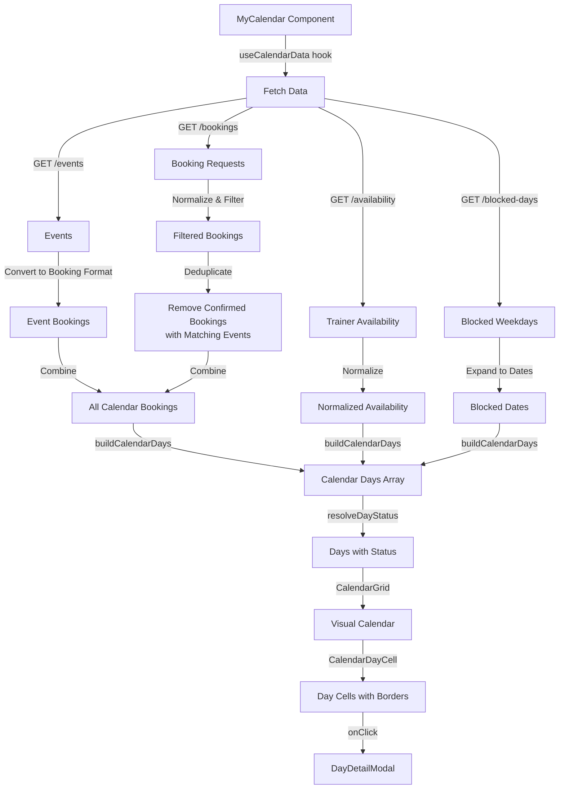

# My Calendar Page - Data Flow Documentation

## Overview

The My Calendar page (`src/pages/MyCalendar.tsx`) is a comprehensive calendar view for trainers to manage their availability, bookings, and events. This document explains how data is fetched from the database and how it's displayed in the calendar interface.

## Architecture Overview

```
┌─────────────────────────────────────────────────────────────┐
│                    MyCalendar Component                      │
│  (src/pages/MyCalendar.tsx)                                  │
└──────────────────────┬──────────────────────────────────────┘
                       │
                       ▼
┌─────────────────────────────────────────────────────────────┐
│              useCalendarData Hook                             │
│  (src/hooks/useCalendarData.ts)                              │
│  • Fetches bookings, events, availability, blocked days     │
│  • Combines and deduplicates data                            │
│  • Returns normalized calendar data                          │
└──────────────────────┬──────────────────────────────────────┘
                       │
                       ▼
┌─────────────────────────────────────────────────────────────┐
│              API Client                                       │
│  (src/lib/api-client.ts)                                      │
│  • REST API calls to backend                                 │
└──────────────────────┬──────────────────────────────────────┘
                       │
                       ▼
┌─────────────────────────────────────────────────────────────┐
│              Backend API (MySQL Database)                     │
│  • booking_requests table                                    │
│  • events table                                              │
│  • trainer_availability table                                 │
│  • trainer_blocked_days table                                │
└─────────────────────────────────────────────────────────────┘
```

## Data Fetching Process

### 1. Initial Data Fetch

When the My Calendar page loads, the `useCalendarData` hook is called with:
- `trainerId`: The authenticated trainer's ID
- `startDate`: First day of the current month
- `endDate`: Last day of the current month

### 2. API Endpoints Called

The hook makes the following API calls in parallel:

#### a) Fetch Booking Requests
```typescript
GET /api/bookings
```
- **Backend Table**: `booking_requests`
- **Returns**: All booking requests for the trainer (filtered by trainer in backend)
- **Fields Used**:
  - `id`, `course_id`, `trainer_id`, `client_id`
  - `requested_date`, `end_date`
  - `status` (pending, approved, confirmed, denied, etc.)
  - `location`, `city`, `state`
  - Related `courses` object with course details

#### b) Fetch Events
```typescript
GET /api/events?trainerId={trainerId}&status=ACTIVE
```
- **Backend Table**: `events`
- **Returns**: Active events created by admin for this trainer
- **Fields Used**:
  - `id`, `courseId`, `trainerId`
  - `eventDate`, `endDate`
  - `title`, `venue`, `city`, `state`
  - Related `course` object

#### c) Fetch Trainer Availability
```typescript
GET /api/availability/trainer/{trainerId}?startDate={startDate}&endDate={endDate}
```
- **Backend Table**: `trainer_availability`
- **Returns**: Availability records for the date range
- **Fields Used**:
  - `id`, `trainer_id`, `date`
  - `status` (available, not_available, booked, tentative)
  - `start_time`, `end_time`

#### d) Fetch Blocked Weekdays
```typescript
GET /api/trainers/{trainerId}/blocked-days
```
- **Backend Table**: `trainer_blocked_days`
- **Returns**: Array of weekday numbers (0=Sunday, 6=Saturday)
- **Purpose**: Days of the week that are permanently blocked

### 3. Data Processing Pipeline

#### Step 1: Normalize Booking Requests
```typescript
// Filter bookings by date range
const filteredBookings = allBookings
  .map(booking => ({
    ...booking,
    requested_date: normalizeDate(booking.requested_date),
    status: booking.status.toLowerCase()
  }))
  .filter(booking => {
    const dateStr = booking.requested_date.split('T')[0];
    return dateStr >= startStr && dateStr <= endStr;
  });
```

#### Step 2: Convert Events to Booking Format
Events are converted to a booking-like structure for unified display:

```typescript
const eventBookings = allEvents.map(event => ({
  id: event.id,
  course_id: event.courseId,
  trainer_id: event.trainerId,
  requested_date: normalizeDate(event.eventDate),
  end_date: normalizeDate(event.endDate),
  status: 'booked', // Events are always booked
  request_type: event.courseType === 'PUBLIC' ? 'public' : 'inhouse',
  courses: {
    id: event.courseId,
    title: event.title || event.course?.title,
    // ... other course fields
  }
}));
```

#### Step 3: Deduplication Logic

**Problem**: When a booking request is confirmed and an event is created for the same course/date, both would appear in the calendar, causing duplicates.

**Solution**: Filter out confirmed bookings that have a corresponding event:

```typescript
// Create identifier set: "courseId:date"
const eventIdentifiers = new Set<string>();
eventBookings.forEach(eventBooking => {
  const identifier = `${eventBooking.course_id}:${eventBooking.requested_date}`;
  eventIdentifiers.add(identifier);
});

// Filter out confirmed bookings that match an event
const deduplicatedBookings = filteredBookings.filter(booking => {
  const bookingStatus = booking.status.toLowerCase();
  
  // Only filter out confirmed bookings
  if (bookingStatus !== 'confirmed') {
    return true; // Keep all non-confirmed bookings
  }
  
  // Check if there's a matching event
  const identifier = `${booking.course_id}:${booking.requested_date}`;
  if (eventIdentifiers.has(identifier)) {
    return false; // Exclude - event will be shown instead
  }
  
  return true; // Keep confirmed bookings without matching events
});
```

**Result**: Only one entry (the event) is displayed for confirmed bookings that have corresponding events.

#### Step 4: Combine Data
```typescript
const allCalendarBookings = [...deduplicatedBookings, ...eventBookings];
```

#### Step 5: Normalize Availability
```typescript
const normalizedAvailability = availabilityArray.map(item => ({
  id: item.id,
  trainer_id: item.trainerId,
  date: item.date.split('T')[0], // YYYY-MM-DD format
  status: item.status.toLowerCase(),
  start_time: item.startTime,
  end_time: item.endTime
}));
```

#### Step 6: Expand Blocked Weekdays
Convert weekday numbers to actual dates in the month:
```typescript
const expandedBlockedDates = [];
const current = new Date(startDate);
while (current <= endDate) {
  if (blockedWeekdays.includes(current.getDay())) {
    expandedBlockedDates.push(formatDate(current));
  }
  current.setDate(current.getDate() + 1);
}
```

## Calendar Display Process

### 1. Build Calendar Grid

The `getCalendarGrid()` function creates an array of Date objects for all days in the current month:

```typescript
const calendarDates = getCalendarGrid(year, month);
// Returns: [Date(2024-01-01), Date(2024-01-02), ..., Date(2024-01-31)]
```

### 2. Build Calendar Days

The `buildCalendarDays()` function processes each date and creates a `CalendarDay` object:

```typescript
const calendarDays = buildCalendarDays(
  calendarDates,
  bookings,
  availabilities,
  blockedWeekdays,
  month
);
```

For each date, it:
1. Finds bookings for that date (including multi-day bookings)
2. Finds availability record for that date
3. Checks if the date is blocked (weekday or explicit block)
4. Resolves the day's status using priority rules

### 3. Status Resolution Priority

The `resolveDayStatus()` function determines the visual status of each day using this priority:

```
1. Blocked (highest priority)
   └─ If weekday is in blockedWeekdays OR date is explicitly blocked
   
2. Booked
   └─ If there are bookings with status 'booked' or 'confirmed'
   
3. Tentative
   └─ If there are bookings with status 'approved' or 'tentative'
   
4. Available/Not Available
   └─ Based on trainer_availability record:
      • 'available' → Available (green border)
      • 'not_available' → Not Available (gray border)
      • If no record exists → Not Available (default)
```

### 4. Multi-Day Bookings

Bookings with `end_date` are displayed on all dates within the range:

```typescript
function getBookingsForDate(bookings, date) {
  return bookings.filter(booking => {
    const bookingStart = booking.requested_date.split('T')[0];
    const bookingEnd = booking.end_date?.split('T')[0];
    
    if (bookingEnd) {
      // Multi-day booking: check if date falls within range
      return dateString >= bookingStart && dateString <= bookingEnd;
    }
    
    // Single-day booking: exact match
    return bookingStart === dateString;
  });
}
```

## Visual Display

### Calendar Grid Component

The `CalendarGrid` component renders the calendar:

```typescript
<CalendarGrid days={filteredDays} onDayClick={setSelectedDay} />
```

### Calendar Day Cell

Each day is rendered by `CalendarDayCell` with:

- **Border Color** (based on status):
  - Green (`border-green-500`): Available
  - Gray (`border-gray-400`): Not Available
  - Red (`border-red-500`): Blocked
  - Yellow (`border-yellow-500`): Tentative
  - Orange (`border-orange-500`): Booked

- **Day Number**: Displayed in the top-left
- **Today Indicator**: Blue ring around today's date
- **Booking Preview**: Shows up to 2 booking titles, with "+X more" if there are additional bookings

### Day Detail Modal

Clicking a day opens `DayDetailModal` showing:
- All bookings for that day (grouped by status)
- Availability information
- Options to edit availability or view booking details

## Data Flow Diagram



## Key Files

- **`src/pages/MyCalendar.tsx`**: Main calendar page component
- **`src/hooks/useCalendarData.ts`**: Data fetching and processing hook
- **`src/lib/calendarUtils.ts`**: Calendar utility functions (date formatting, status resolution, etc.)
- **`src/components/calendar/CalendarGrid.tsx`**: Grid layout component
- **`src/components/calendar/CalendarDayCell.tsx`**: Individual day cell component
- **`src/components/calendar/DayDetailModal.tsx`**: Day detail popup
- **`src/lib/api-client.ts`**: API client for backend communication

## Database Tables

### booking_requests
- Stores client booking requests
- Key fields: `id`, `course_id`, `trainer_id`, `requested_date`, `end_date`, `status`
- Status values: `pending`, `approved`, `confirmed`, `denied`, `tentative`, `booked`, `canceled`

### events
- Stores events created by admin
- Key fields: `id`, `courseId`, `trainerId`, `eventDate`, `endDate`, `title`, `status`
- Status: `ACTIVE`, `COMPLETED`, `CANCELLED`

### trainer_availability
- Stores trainer's availability for specific dates
- Key fields: `id`, `trainer_id`, `date`, `status`, `start_time`, `end_time`
- Status values: `available`, `not_available`, `booked`, `tentative`

### trainer_blocked_days
- Stores permanently blocked weekdays
- Key fields: `trainer_id`, `day_of_week` (0-6)

## Important Notes

1. **Date Format**: All dates are normalized to `YYYY-MM-DD` format for consistent comparison
2. **Status Priority**: Blocked > Booked > Tentative > Available/Not Available
3. **Deduplication**: Confirmed bookings are hidden if a matching event exists (same course + date)
4. **Multi-Day Support**: Bookings with `end_date` appear on all dates in the range
5. **Default Status**: Days without availability records default to "not_available"
6. **Real-Time Updates**: The `refetch()` function can be called to refresh data after changes

## Example Data Flow

1. **User navigates to My Calendar**
   - Component mounts, `useCalendarData` hook runs
   - Fetches bookings, events, availability, blocked days for current month

2. **Data Processing**
   - Bookings filtered by date range
   - Events converted to booking format
   - Deduplication removes confirmed bookings with matching events
   - Availability normalized and blocked weekdays expanded

3. **Calendar Building**
   - `buildCalendarDays()` creates CalendarDay objects for each date
   - `resolveDayStatus()` determines visual status for each day
   - Days sorted by processing time

4. **Rendering**
   - `CalendarGrid` renders day cells in 7-column grid
   - Each `CalendarDayCell` shows date, status border, and booking previews
   - Clicking a day opens `DayDetailModal` with full details

5. **User Interaction**
   - Clicking a day → Opens detail modal
   - Editing availability → Calls API → Refetches data → Calendar updates
   - Changing month → Recalculates date range → Refetches data

